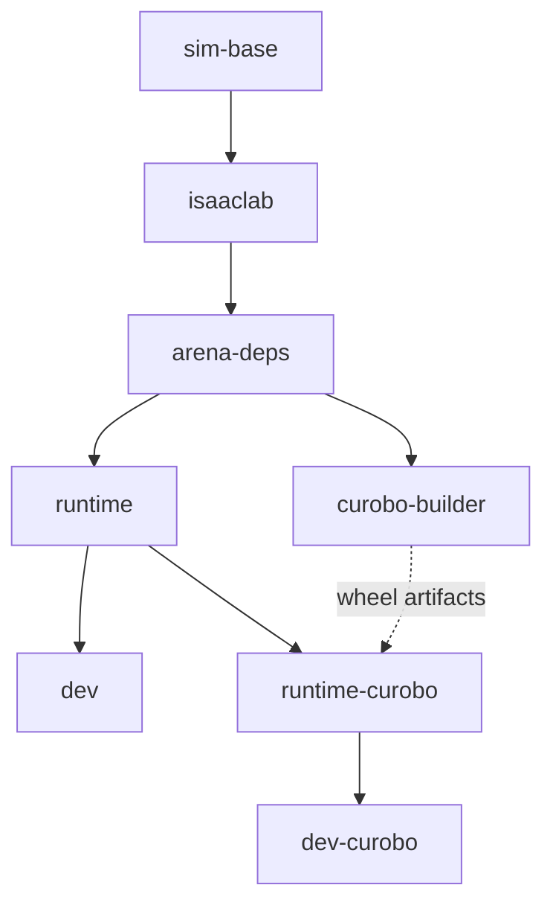

# Arena Docker build design

**Status: implemented and built locally; validation has two baseline failures.** CI integration and remote publishing remain deferred.

## Scope and sequence

1. **Local build and test:** refactor the Dockerfile and setup scripts, build all four targets under separate local candidate tags, and validate them locally. No registry publishing or CI changes in this phase.
2. **CI integration — deferred:** build candidates before tests, run tests against those exact images, and update the post-merge main workflow to publish the remote build cache. Verify on a test branch using unique candidate image/cache tags before changing shared release tags.

Preserve existing dependencies, supported workflows, paths, permissions, and default developer-image behavior. Dependency upgrades, aggressive image slimming, GR00T checkout trimming, and permission redesign are separate optimizations.

## Stage graph and contents

Solid arrows mean `FROM` inheritance. The dashed arrow transfers build artifacts only. Select the four public targets with `--target`, without boolean feature-selection build arguments.

Each stage adds the following to its parent's contents:

| Stage | Contents added |
| --- | --- |
| `sim-base` | Isaac Sim `6.1.0` base and its Python/Kit libraries; common OS packages (`git`, `git-lfs`, `cmake`, `ffmpeg`, `sudo`, `jq`, `python3-pip`, `pqiv`); Vulkan workaround; workspace setup. |
| `isaaclab` | Pinned Isaac Lab checkout, `_isaac_sim` link, existing Kit permission fixes, and `isaaclab.sh -i`. Preserve its Torch stack, Newton/PhysX, task packages, Mimic, teleoperation, RSL-RL, and visualizers. |
| `arena-deps` | Third-party dependencies from project metadata; lightweight GR00T/OpenPI clients and shared policy transports; AWS/HTTP compatibility repairs. User tools: search, review UI, notebooks, pipx-isolated Hugging Face CLI, and OSMO CLI. No Arena application source. |
| `runtime` | All first-party Arena packages/adapters, examples, required metadata/data, and currently copied docs/fixtures; editable Arena install with `--no-deps`; entrypoint, common aliases/prompt, runtime defaults. |
| `dev` | `pre-commit`, GitHub CLI, `debugpy`, and developer-only shell setup. |
| `curobo-builder` | CUDA toolkit/compiler/headers, wheel-build requirements, pinned cuRobo source, and resulting wheels/build metadata under `/wheels`. No Arena source. |
| `runtime-curobo` | Validated cuRobo runtime dependencies and installed wheel contents; required CUDA runtime environment settings. |
| `dev-curobo` | Same developer additions as `dev`, using the same script; inherits installed cuRobo from `runtime-curobo`. |
| `default` | Final `FROM dev AS default` alias; no additional contents. Keeps no-target builds compatible. |

Dependency placement details:

- All current `[project.dependencies]`, including `pytest`, belong in `arena-deps`; keep constraints in `pyproject.toml` as the source of truth.
- GR00T client/resources, `msgpack`, `msgpack-numpy`, `pyzmq`, `av`, and pinned `openpi-client` also belong in `arena-deps`. Preserve lightweight GR00T installation and the shared OpenPI/Cosmos transport.
- **Selected runtime boundary:** place `jupyter`, `tenacity`, `streamlit`, `streamlit-ace`, and `simready-search` in `arena-deps`, with Hugging Face and OSMO CLIs. Move `debugpy` from the mixed current `[dev]` extra into the developer additions.
- `runtime` includes the core, Cosmos, cuRobo, DreamZero, G1, GR00T, OpenPI, environments, and examples packages. The cuRobo adapter source is present in every target; the external cuRobo library is installed only in the cuRobo targets.
- GR00T, OpenPI, Cosmos, and DreamZero inference servers remain separate environments. Model weights/datasets remain external mounts.

## Cache boundaries and cuRobo

Install third-party dependencies before copying Arena source. Derive installation inputs from project metadata rather than maintaining another package list. Copy actual source before the editable `--no-deps` install; empty-source package discovery is insufficient. Avoid early `COPY *.*` or copying all setup scripts into a shared ancestor.

Preserve client-install ordering and the AWS/HTTP repairs (`boto3==1.40.61`, `botocore==1.40.61`, `s3transfer==0.14.0`, `requests==2.32.3`). Do not apply the native `uv.lock` blindly to Isaac Sim's prebundled interpreter. Later developer/cuRobo installs must not change the validated Torch ABI or undo compatibility repairs.

Build cuRobo against the consuming Python/Torch/CUDA stack, initially preserving:

- Revision `ebb71702f3f70e767f40fd8e050674af0288abe8`.
- CUDA `12.8` and architectures `8.0+PTX;8.6+PTX;8.9+PTX;9.0+PTX`.
- Current no-build-isolation behavior; record wheel checksums and build versions.

Install wheels through a read-only BuildKit mount from `/wheels`, after installing validated runtime dependencies. Only installed files enter `runtime-curobo`; builder layers and wheel archives do not. `dev-curobo` inherits that installation.

An Arena source edit must not reinstall Isaac Lab or recompile cuRobo. Changes to cuRobo's revision, build script, architectures, or ABI inputs must rebuild it. Non-cuRobo targets skip the builder entirely. Do not remove runtime toolkit/JIT components until a real GPU IK solve with empty extension caches proves they are unnecessary.

## Scripts and environment

Keep one Dockerfile for stage inheritance, copied inputs, script ordering, persistent `ARG`/`ENV`, and `ENTRYPOINT`. Move coherent shell tasks into `docker/setup/`:

| Script | Stage / responsibility |
| --- | --- |
| `install-system-deps.sh` | `sim-base`: common OS packages and Vulkan workaround. |
| `install-isaaclab.sh` | `isaaclab`: symlink/permission setup and existing installer. |
| `install-policy-clients.sh` | `arena-deps`: pinned lightweight clients. |
| `install-arena-deps.sh` | `arena-deps`: derived dependencies, selected user tools, compatibility repairs. |
| `install-dev-tools.sh` | Both developer targets: shared contributor tools and debug alias. |
| `build-curobo-wheel.sh` | `curobo-builder`: toolchain and wheel build. |
| `install-curobo-runtime-deps.sh` | `runtime-curobo`: required libraries and any validated JIT components. |
| `configure-shell.sh` | `runtime`: common aliases and prompt. |
| Existing `entrypoint.sh` | Container startup: host-user setup, mounted directories, command execution. |

Use Bash with `set -euo pipefail`; mount or copy only the scripts needed by each build step. Add a build-only entry point shared by launcher/publisher, so builds do not automatically start or attach to containers. Publisher integration belongs to the deferred CI phase.

| Setting | Owner |
| --- | --- |
| `WORKDIR` | `sim-base`; supported entry points preserve `/workspaces/isaaclab_arena`. |
| `ISAACLAB_PATH`, `_isaac_sim`, `TERM` | `isaaclab`; retain entrypoint link repair for mounted checkouts. |
| `LW_API_ENDPOINT` default, common aliases | `runtime`; preserve the current endpoint and explicit `/isaac-sim/python.sh` use outside interactive shells. |
| CUDA paths, architecture list | Build settings in `curobo-builder`; independently define runtime settings in `runtime-curobo` where needed. Builder environment does not cross the artifact mount. |
| Host IDs, credentials, endpoints, GPU/display options, mounts | Launcher/CI inputs at startup; preserve the current `DOCKER_RUN_*` contract. |

Keep existing chmod/chown behavior. The audit found no worthwhile reason for special permission handling; `umask` does not change existing files. Preserve editable source paths, mount behavior, and OSMO path assumptions.

## Targets and compatibility

| Target | Intended tag / compatibility alias |
| --- | --- |
| `runtime` | `:runtime` |
| `dev` | `:dev`, `:latest` |
| `runtime-curobo` | `:runtime-curobo` |
| `dev-curobo` | `:dev-curobo`, `:curobo` |

Keep launcher defaults mapped to `dev`, `-c` to `dev-curobo`, and add explicit target selection for runtime variants. Preserve cached/no-cache rebuild options, per-checkout containers, mounts, and host-user execution. Document migration from direct `INSTALL_CUROBO` build-argument usage. Use isolated candidate tags during validation rather than overwriting ordinary images.

## Phase 1: local acceptance checks

Two required verification outcomes:

1. **Run all repository tests locally against the candidate images**, including the test groups and integrations below. Record failures, skips, and unavailable external prerequisites; an incomplete run is not a full pass.
2. **A local Arena source edit must not trigger an image rebuild in the normal development workflow.** With the image built, cache warm, and checkout mounted, edit a source file and verify a new Python/test process sees the change while the image ID remains unchanged and the launcher invokes no build. If an image rebuild is explicitly requested, source-copy/package layers must update, but expensive dependencies and cuRobo compilation must remain cached. Restore the test edit afterward.

- Build all four targets and verify target selection, default behavior, and skipped cuRobo stages for ordinary builds.
- Check imports, package data, advertised tools, and host-user startup, both with and without the checkout mounted. Include a simulation smoke test using baked source.
- Run the existing Newton, PhysX without cameras, PhysX with cameras, and subprocess test groups. Run GR00T client/data tests and its separate-server closed-loop check.
- On both cuRobo targets, verify extension import, validator registration, and an actual GPU IK solve with empty extension caches. Mocked/import-only tests are insufficient.
- Check OpenPI client/server pin agreement, user-facing UI/search/notebook tools, and OSMO path/configuration assumptions. Preserve native uv behavior if shared dependency metadata changes.
- Verify unchanged and source-only rebuilds reuse the expected stages; dependency/build-input changes invalidate the appropriate stages. Report remaining failures or unavailable external services explicitly.

## Local validation result

All four targets build. Mounted source edits are visible without rebuilding; explicit source-only builds reuse Isaac Lab, dependency installation, and cuRobo compilation. Baked-source simulation, user tools, GR00T integration, and cold-cache cuRobo GPU IK checks pass. Shell, Dockerfile, and pre-commit checks pass.

The test sweep covered **1,413 distinct cases: 1,403 passed, seven skipped, one expected failure, and two failed**. Both failures reproduce on the original image:

- `isaaclab_arena_g1/g1_whole_body_controller/wbc_policy/tests/test_g1_agile_policy.py::test_agile_standing`: robot falls.
- `isaaclab_arena_examples/tests/test_review_gui.py::TestSimAppSimPreview::test_run_sim_preview_via_simapp_subprocess`: expected one viewport video, found zero.

Five skips require endpoint credentials; two are existing Mimic skips. This is not a fully passing suite.

Two notebook examples needed import guards to avoid starting another simulator during test collection/execution; that crash also reproduced on the original image. After the guards, targeted tests and the remaining non-camera cases passed. The non-camera total combines the initial successful cases with a resumed run. Preview failure cleanup also hung; the baseline comparison used a temporary shutdown timeout without changing preview behavior.

Detailed results, image IDs, JUnit files, and build logs are in `/tmp/arena-local-validation/`. The user approved committing with these baseline failures documented. The follow-up unexpected-rebuild investigation ran on `dev-curobo`; results are below. No CI changes are included.

## Unexpected-rebuild investigation (`dev-curobo`)

A normal launcher run of the zero-action `cube_goal_pose` scene completed without invoking a Docker build or changing the image ID. Explicit builds before and after the scene reused every COPY/RUN step. Only two files under `outputs/` appeared; neither entered a copied Docker path.

Isolated COPY probes found two early-stage invalidation triggers without source edits: the entrypoint-created `submodules/IsaacLab/_isaac_sim` symlink and generated `*.egg-info` metadata. The symlink already existed in this checkout, so this scene run did not reproduce the first-launch case. Ignored bytecode and timestamp-only changes retained cache. Root notes and editor settings also invalidate the broad `COPY *.*`, but only at the later runtime boundary.

Recommended follow-up: exclude the generated symlink and package metadata, then narrow the root wildcard to required files. The proposed ignore rules retained cache in an isolated probe; production exclusions remain unchanged. These are verified possible triggers, not a diagnosis of the original user's particular rebuild. Detailed evidence: `/tmp/arena-rebuild-investigation/report.md`.

## Phase 2: CI and remote cache — deferred

NGC registry-cache compatibility is verified: a tiny multi-stage build exported a cache, and a separate builder with no local cache reused all steps. Full Arena remote-cache performance and CI credentials remain untested.

1. Add CI build jobs before image-dependent tests. Use Buildx with the `docker-container` driver and NGC `--cache-from type=registry,ref=<cache-tag>`.
2. Push uniquely tagged candidate images and pass their exact digests to the test jobs. During isolated verification, use separate experiment image/cache tags on a test branch; leave shared release tags unchanged.
3. Point the main Arena, subprocess, and GR00T closed-loop jobs at the `dev` candidate, and cuRobo checks at `dev-curobo`. Keep the GR00T sidecar and native uv environment separate. Check baked-image behavior as well as mounted checkout tests.
4. Update the post-merge main build to export cache with `--cache-to type=registry,ref=<cache-tag>,mode=max,oci-mediatypes=true,image-manifest=true`. Use separate default/cuRobo cache tags and one writer per tag; PRs import the shared main cache without overwriting it.
5. Publish release aliases only for validated main-branch candidates, retaining the tested digest. Reuse the pre-test build artifact for publication; do not rebuild a different image after testing. A changed main commit needs its own candidate.

The first full cache must be seeded. A cache miss allows a cold build; registry/authentication failures remain visible. Fresh runners still download/extract layers, so measure remote transfer separately from installation/compilation. Choose candidate retention and required promotion checks when implementing this phase.

## Implementation findings

- **Dependency extraction:** `export_requirements.py` reads `pyproject.toml` with the bundled Python's `tomllib`. All 25 existing requirement declarations are retained: 24 in runtime and explicit `debugpy` in developer targets. The built runtime preserves the baseline package set; the only observed version drift is the unconstrained transitive `platformdirs` patch version.
- **Host-user startup:** create the user's home directory explicitly, so the existing entrypoint also works without host home/cache mounts.
- **cuRobo runtime closure:** inherited Torch/CUDA libraries plus the wheel's declared requirements are sufficient for the cold-cache GPU IK check. Compiled extensions, bundled robot assets, and validator registration work without runtime `nvcc`; builder layers and wheel archives stay out of runtime.

Recommended scope: retain the current launcher/host-user contract; defer arbitrary standalone-user defaults, GR00T trimming, and further slimming. Phase 2 stays deferred until local validation is complete and the user gives the go-ahead.

Reference inputs: [Dockerfile](docker/Dockerfile.isaaclab_arena), [project metadata](pyproject.toml), [launcher](docker/run_docker.sh), [CI](.github/workflows/ci.yml), [Docker registry cache](https://docs.docker.com/build/cache/backends/registry/). Historical experiment logs remain under `/tmp/arena-build-profile/`, `/tmp/arena-cache-profile/`, and `/tmp/arena-ngc-cache-probe-20260916-143519-307e35/`; timing tables are intentionally omitted from this design.
